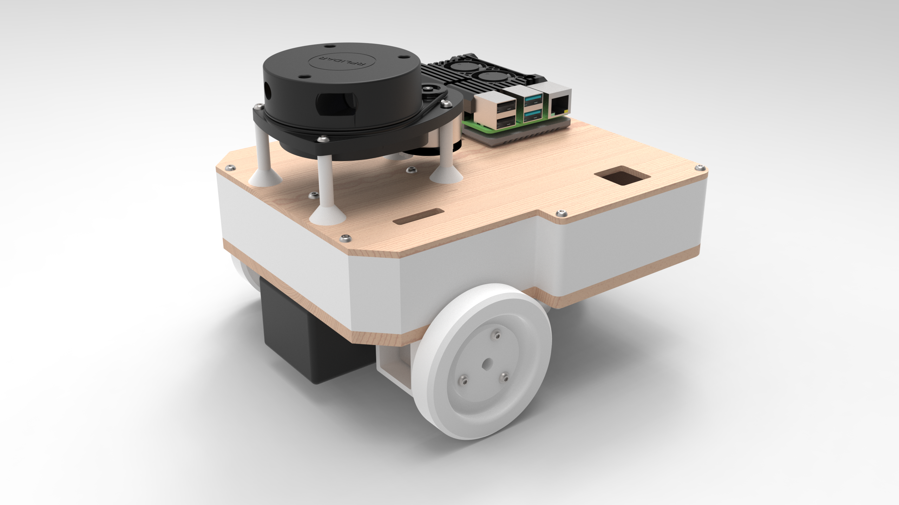

- `3D модель MEPhI_ROS2_drone`: содержит исходные файлы 3D моделей деталей робота, спроектированные в САПР КОМПАС-3D v23.0.3.2285
- `DXF`: содержит файлы в формате `.dxf` для лазерной резки
- `STL`: содержит файлы в формате `.stl` для 3D печати

  

