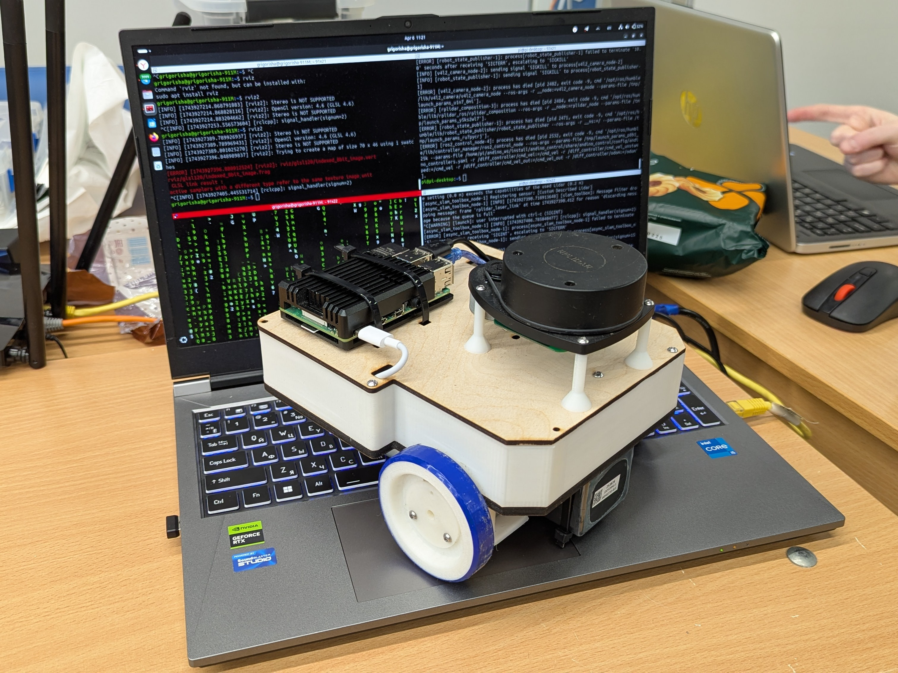

# MEPhI_ROS2_drone

MEPhI_ROS2_drone - это двухколесный робот с открытым исходным кодом, разработанный для образовательных целей командой студентов из НИЯУ МИФИ. MEPhI_ROS2_drone полностью интегрирован с ROS2 и является отличной базовой платформой для плавного введения в ROS2. Благодаря открытому коду и исходным файлам 3D моделей любой желающий может модифицировать и настроить робота в соответствии со своими требованиями.

*Данный проект является форком проекта [Andino](https://github.com/Ekumen-OS/andino), ПО, конструкция и электрическая схема которого были доработаны под наши требования.

<p align="center">
  
</p>

## Описание проекта
- [`3D`](./3D): 3D модели деталей и сборки робота, также содержит `.stl` для 3D печати и `.dxf` для лазерной резки
- [`schematic`](./schematic): электрическая схема робота и инструкция по ее сборке
- [`MEPhI_ROS2_drone_hardware`](./andino_hardware): содержит инструкцию по сборке `MEPhI_ROS2_drone` и перечень используемого оборудования
- [`MEPhI_ROS2_drone_bringup`](./andino_bringup): сдержит в основном файлы запуска для старта всех связанных драйверов и узлов, которые будут использоваться в роботе
- [`MEPhI_ROS2_drone_description`](./andino_description): содержит описание робота в формате `.URDF`
- [`MEPhI_ROS2_drone_firmware`](./andino_firmware): содержит код отладочной платы Arduino UNO R3 для сопряжения с raspberry pi 4 и инструкцию по его заливке на плату
- [`MEPhI_ROS2_drone_base`](./andino_base): это программно-аппаратный модуль проекта, который обеспечивает связь с микроконтроллером для управления моторами и предоставляет утилиты для отладки
- [`MEPhI_ROS2_drone_control`](./andino_control/): запускает [controller_manager](https://control.ros.org/humble/doc/ros2_control/controller_manager/doc/userdoc.html) вместе с [ros2 controllers](https://control.ros.org/master/doc/ros2_controllers/doc/controllers_index.html): [diff_drive_controller](https://control.ros.org/master/doc/ros2_controllers/diff_drive_controller/doc/userdoc.html) and the [joint_state_broadcaster](https://control.ros.org/master/doc/ros2_controllers/joint_state_broadcaster/doc/userdoc.html)
- [`MEPhI_ROS2_drone_slam`](./andino_slam/): обеспечивает работу SLAM (одновременная локализация и построение карты)
- [`MEPhI_ROS2_drone_navigation`](./andino_navigation/): стек навигации, основанный на `nav2`

## Установка

Remember to first go over the assembly instructions at [`andino_hardware`](./andino_hardware/)!

### Platforms

- ROS 2: Humble Hawksbill
- OS:
  - Ubuntu 22.04 Jammy Jellyfish
  - Ubuntu Mate 22.04 (On real robot (e.g: Raspberry Pi 4B))

### Via ansible

See [`andino_ansible_config`](https://github.com/garyservin/andino_ansible_config): This repository contains Ansible configurations for managing and automating the setup and configuration of an Andino robot.

### Build from Source

#### Dependencies

1. Install [ROS 2](https://docs.ros.org/en/humble/Installation/Ubuntu-Install-Debians.html)
2. Install [colcon](https://colcon.readthedocs.io/en/released/user/installation.html)

#### colcon workspace

Packages here provided are colcon packages. As such a colcon workspace is expected:

1. Create colcon workspace

```
mkdir -p ~/ws/src
```

2. Clone this repository in the `src` folder

```
cd ~/ws/src
```

```
git clone https://github.com/Ekumen-OS/andino.git
```

3. Install dependencies via `rosdep`

```
cd ~/ws
```

```
rosdep install --from-paths src --ignore-src -i -y
```

4. Build the packages

```
colcon build
```

5. Finally, source the built packages
   If using `bash`:

```
source install/setup.bash
```

`Note`: Whether your are installing the packages in your dev machine or in your robot the procedure is the same. Remember to go over the assembly instructions first.

### Install the binaries

The packages have been also released via ROS package manager system for the 'humble' distro. You can check them [here](https://repo.ros2.org/status_page/ros_humble_default.html?q=andino).

These packages can be installed using `apt` (e.g: `sudo apt install ros-humble-andino-description`) or using `rosdep`.

## :rocket: Usage

### Robot bringup

`andino_bringup` contains launch files that concentrates the process that brings up the robot.

After installing and sourcing the andino's packages simply run.

```
ros2 launch andino_bringup andino_robot.launch.py
```

This launch files initializes the differential drive controller and brings ups the system to interface with ROS.
By default sensors like the camera and the lidar are initialized. This can be disabled via arguments and manage each initialization separately. See `ros2 launch andino_bringup andino_robot.launch.py -s ` for checking out the arguments.

- include_rplidar: `true` as default.
- include_camera: `true` as default.

After the robot is launched, use `ROS 2 CLI` for inspecting environment.
For example, by doing `ros2 topic list` the available topics can be displayed:

    /camera_info
    /cmd_vel
    /image_raw
    /odom
    /robot_description
    /scan
    /tf
    /tf_static

   _Note: Showing just some of them_

### Teleoperation

Launch files for using the keyboard or a joystick for teleoperating the robot are provided.

#### Keyboard

```
ros2 launch andino_bringup teleop_keyboard.launch.py
```
This is similarly to just executing `ros2 run teleop_twist_keyboard teleop_twist_keyboard`.

#### Joystick

Using a joystick for teleoperating is notably better.
You need the joystick configured as explained [here](andino_hardware/README.md#Using-joystick-for-teleoperation).
```
ros2 launch andino_bringup teleop_joystick.launch.py
```

### RViz

Use:

```
ros2 launch andino_bringup rviz.launch.py
```

For starting `rviz2` visualization with a provided configuration.

## :compass: Navigation

The [`andino_navigation`](./andino_navigation/README.md) package provides a navigation stack based on the great [Nav2](https://github.com/ros-planning/navigation2) package.

https://github.com/Ekumen-OS/andino/assets/53065142/29951e74-e604-4a6e-80fc-421c0c6d8fee

Follow the [`andino_navigation`'s README](./andino_navigation/README.md) instructions for bringing up the Navigation stack in the real robot or in the simulation.

## :computer: Simulation


Within the Andino ecosystem simulations on several platforms are provided:
 - [`andino_gz_classic`](./andino_gz_classic/README.MD) - (To be deprecated as of Jazzy)
 - [`andino_gz`](https://github.com/Ekumen-OS/andino_gz) - **Recommended**
 - [`andino_webots`](https://github.com/Ekumen-OS/andino_webots)
 - [`andino_o3de`](https://github.com/Ekumen-OS/andino_o3de)
 - [`andino_isaac`](https://github.com/Ekumen-OS/andino_isaac)


## :selfie: Media

### RVIZ Visualization

https://github.com/Ekumen-OS/andino/assets/53065142/c9878894-1785-4b81-b1ce-80e07a27effd

### Slam

Using the robot for mapping.

https://github.com/Ekumen-OS/andino/assets/53065142/283f4afd-0f9a-4d37-b71f-c9d7b2f3e453

https://github.com/Ekumen-OS/andino/assets/53065142/d73f6053-b422-4334-8f62-029a38799e66


See [`andino_slam`](./andino_slam/) for more information.