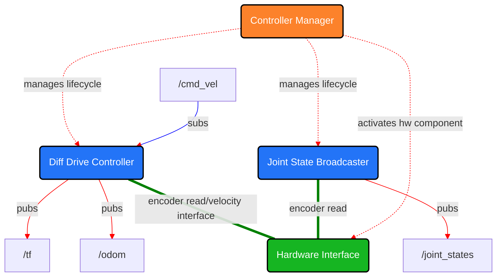

# MEPhI_ROS2_drone_control

## Описание

Для управления роботом и взаимодействия с фреймворком ROS используется ROS2 Control.

Следующая диаграмма описывает основные компоненты системы, управляющей роботом с помощью инструментов ROS2 Control.

### Hardware Interface

Компонент аппаратного интерфейса для этого робота реализован в пакете [`MEPhI_ROS2_drone_base`](/andino_base/). Он отвечает за предоставление необходимых интерфейсов состояния и команд, которые используются контроллерами.

### Controller Manager

[Controller Manager](https://control.ros.org/humble/doc/ros2_control/controller_manager/doc/userdoc.html#controller-manager) управляет жизненным циклом контроллеров, доступом к аппаратным интерфейсам и предоставляет сервисы для ROS.

Аппаратный интерфейс, который активируется при запуске узла `controller_manager`, указывается через описание робота, передаваемое через параметр ROS2. В описании робота должен присутствовать тег `<ros2_control>`, содержащий информацию о компонентах оборудования, а также интерфейсы состояния и команд. Смотреть [`andino_control.urdf.xacro`](../andino_description/urdf/include/andino_control.urdf.xacro).

### ROS2 Controllers

Используются два контроллера из библиотеки [ros2_controllers](https://control.ros.org/humble/doc/ros2_controllers/doc/controllers_index.html):

- [diff_drive_controller](https://control.ros.org/humble/doc/ros2_controllers/diff_drive_controller/doc/userdoc.html): контроллер для мобильных роботов с дифференциальным приводом. На вход принимает команды скорости движения робота, которые преобразуются в команды для колес. Одометрия вычисляется на основе данных с аппаратуры и публикуется.
  - Используемые интерфейсы состояния:
    - скорость левого колеса
    - скорость правого колеса
    - положение левого колеса
    - положение правого колеса
  - Используемые интерфейсы команд:
    - скорость левого колеса
    - скорость правого колеса
- [joint_state_broadcaster](https://control.ros.org/humble/doc/ros2_controllers/joint_state_broadcaster/doc/userdoc.html): считывает все интерфейсы состояния и публикует их в `/joint_states` и `/dynamic_joint_states`.
  - Используемые интерфейсы состояния:
    - положение левого колеса
    - положение правого колеса

Каждый контроллер принимает параметры ROS2, которые задаются в файле [`andino_controllers.yaml`](config/andino_controllers.yaml). 